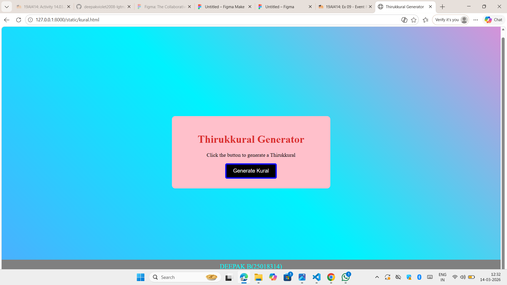

# Quote_Generator
## Date:14.03.2026
## Objective:
To create a simple thirukkural generator using HTML, CSS, and JavaScript that displays a new random thirukkural each time a button is clicked — similar to daily quote sections on blogs or productivity apps.

## Tasks:

### 1. Create the HTML Structure:
<ul>
  <li>Add a heading Thirukkural Generator</li>
  <li>Use a div or p to display the Thirukkural (Tamil couplet).</li>
  <li>Use another p or span to display the meaning or explanation.</li>
  <li>Add a button labeled “Get Thirukkural”.</li>
  <li>Add a label showing the Kural number.</li>
</ul>

### 2. Style the Layout Using CSS:

<ul>
  <li>Center everything on the page using Flexbox.</li>
  <li>Style the quote box with:
  <ul type="square">
    <li>Padding</li>
    <li>Background color</li>
    <li>Rounded borders</li>
    <li>Soft shadow</li>
    <li>Add hover effects for the button.</li>
  </ul>
  </li>
</ul>

### 3. Add JavaScript Functionality:
<ul>
  <li>Store an array of Thirukkural objects containing:
  <ul type="square">
    <li>Kural number</li>
    <li>Kural Meaning</li>
  </ul>
  </li>
  <li>When the button is clicked:
  <ul type="square">
    <li>Generate a random index using Math.random().</li>
    <li>Retrieve the corresponding Thirukkural object.</li>
    <li>Display the Kural number and meaning in the HTML.</li>
    <li>Update content dynamically using innerText.</li>
  </ul>
  </li>
</ul>

## Code:
```
<html>
<head>
<title>Thirukkural Generator</title>

<style>
body{
    background: linear-gradient(45deg,#4facfe,#00f2fe,rgb(216, 145, 216));
    height:100vh;
    display:flex;
    justify-content:center;
    align-items:center;
}

.container{
    background:pink;
    padding:30px;
    border-radius:10px;
    text-align:center;
    width:420px;
}
h1{
    margin-bottom:20px;
    color:rgb(219, 48, 48);
}
button{
    padding:10px 20px;
    font-size:16px;
    border:4px solid blue;
    border-radius:5px;
    background:black;
    color:white;
}
button:hover{
    background:#0056b3;
    transform:scale(1.1);
}
.footer{
    background:grey;
    color:cyan;
    padding:10px;
    position:fixed;
    bottom:30;
    width:100%;
    text-align:center;
    font-size:20px;
}
</style>

</head>
<body>

<div class="container">
<h1>Thirukkural Generator</h1>

<p id="kural">Click the button to generate a Thirukkural</p>
<p id="meaning"></p>

<button onclick="generateKural()">Generate Kural</button>
</div>
<div class="footer">
    DEEPAK B(25018314)
</div>

<script>
let kurals = [
    {
        kural: "Kural 1: அகர முதல எழுத்தெல்லாம் ஆதி பகவன் முதற்றே உலகு.",
        meaning: "Everything begins with the Supreme just like the alphabet begins with A."
    },
    {
        kural: "Kural 2: கற்றதனால் ஆய பயனென்கொல் வாலறிவன் நற்றாள் தொழாஅர் எனின்",
        meaning: "Knowledge is meaningful only when it leads to wisdom and humility."
    },
    {
        kural: "Kural 3: அறத்தான் வருவதே இன்பம் மற்றெல்லாம் புறத்த புகழும் இல.",
        meaning: "Living with righteousness brings peace and fulfillment."
    },
    {
        kural: "Kural 4: இனிய உளவாக இன்னாத கூறல் கனியிருப்பக் காய்கவர்ந் தற்று",
        meaning: "Kind speech brings joy just like ripe fruit is better than unripe fruit."
    },
    {
        kural: "Kural 5: ஒழுக்கம் விழுப்பந் தரலான் ஒழுக்கம் உயிரினும் ஓம்பப்பட வேண்டும்",
        meaning: "Character is more valuable than wealth or status."
    }
];

let index = 0;

function generateKural()
{
document.getElementById("kural").innerText = kurals[index].kural;
document.getElementById("meaning").innerText = kurals[index].meaning;

index++;

if(index >= kurals.length)
{
    index = 0;
}

}
</script>
</body>
</html>
```
## Output:

## Result:
A simple quote generator using HTML, CSS, and JavaScript that displays a new random motivational quote each time a button is clicked — similar to daily quote sections on blogs or productivity apps is created successfully.
